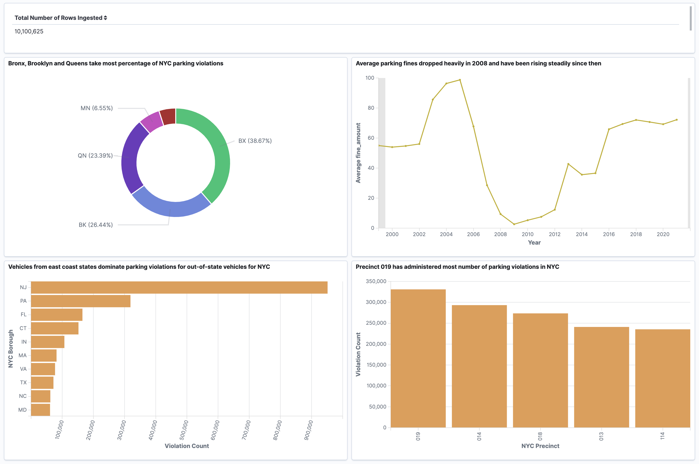

# Analyzing Millions of NYC Parking Violations Data

Ingest and Analyze Over 10 million NYC Parking Violations Data using AWS EC2, Elastic Search (OpenSearch) and Kibana

##### Keywords
- Docker Containers
- AWS OpenSearch
- AWS EC2
- Kibana
- Python

In this project, we analyze over ten million rows of data using AWS OpenSearch (ElasticSearch) domains. To accomplish this task, Docker technology is used to run python scripts on a system agnostic AWS EC2 instance. Once all desired data are ingested into the OpenSearch Instance, the AWS built-in Kibana visualization software is used to analyze the processed data for possible trends. 

This README file will describe the steps needed to succesfully run the code and disucss some of the interesting findings from the visual analysis.

## Dataset

Open Parking and Camera Violations fron NYC Open Data Website accessed via Socrata API- https://dev.socrata.com/foundry/data.cityofnewyork.us/nc67-uf89


## Accessing the files

The project files are in a zip folder with the following structure:

```sh
project01/
+-- Dockerfile
+-- requirements.txt
+-- src/
+-- +-- main.py
+-- assets/
+-- +-- kibanadashboard.png
+-- README
```


## Running the code 

This program requires a CLI terminal such as an AWS EC2 instance terminal to run the docker container. The example below shows how to run the code using such an AWS EC2 instance.

Launch AWS EC2 instance
Start a new session
Login to the session as admin as follows:

```sh
$ sudo su
```

Change directory to the **project01** folder:

```sh
cd project01
```

Build the docker container:

```sh
docker build -t bigdata1:1.0 .
```

Once the docker container is created, run the command in the following structure to start the program:
```sh
docker run -v $PWD:/app -e DATASET_ID='nc67-uf89' -e APP_TOKEN="YOUR APP TOKEN" -e ES_HOST="YOUR ELASTIC SEARCH HOST" -e INDEX_NAME='parking' -e ES_USERNAME='YOUR USERNAME' -e ES_PASSWORD='YOUR PASSWORD!' bigdata1:1.0 --page_size=1000  --num_pages=3
```

**Notes on the environment variables and command arguments:**

DATASET_ID ='nc67-uf89' - defines the NYC parking violations dataset from  Socrata API

APP_TOKEN="YOUR APP TOKEN" - defines the personal app token extracted from the nyc open data website

ES_HOST="YOUR ELASTIC SEARCH HOST" - defines the hyperlink for the AWS OpenSearch domain (Note: Might need to remove quotations when passing the hyperlink)

INDEX_NAME='parking' - defines the index name (table name) that will be created in the ES Host after running this command. This index can be changed as user wishes.

ES_USERNAME = 'YOUR USERNAME' - defines the username used during creation of AWS OpenSearch domain

-e ES_PASSWORD='YOUR PASSWORD!'- defines the password used during creation of AWS OpenSearch domain 

bigdata1:1.0 - defines the docker container containing the program built by using the docker build command

a  --page_size= xxx - defines the argument that determines how many rows of data to fetch per page. This number can be changed as user wishes but it is a required argument for the code to run.

--num_pages= xxx - defines the argument that determines how many pages to fetch in total. This number can be changed as user wishes and it is also an optional argument for the code to run. If the num_pages argument is not defined, the code will default the number of pages to fetch to 1 and run the code.


## Perfomance 

The program allowed for an ingestion of 10,100,625 rows in one go. 
The total runtime for the entire code was 4320 seconds or 1 hour 12 minutes with a rate of 2340 rows/second. 

The hardware configuration to acheive this performance are as follows:

- AWS EC2 Instance
    - t2.micro
- AWS OpenSearch Domain
    - *Elastic Search Version* - 7.10
    - *Instance* - r6g.large.search
    - *Number of Master Nodes* - 3
    - *Number of Shards* - 1
    - *Number of Replicas* - 1

 ## Data Analysis
 
 
 
 ### Analysis 1: Parking violations distribution by NYC borough (top left)
 
 We can see that the three boroughs of Bronx, Brooklyn and Queens take majority share of the parking violations. This can be explained by just the number of residents living in these boroughs compared to Manhattan and Staten Island.
 
  ### Analysis 2: Average parking fine trend over the years (top right)
 
Average parking fines we generally higher in the early 2000s possibly due to the much lower population of NYC compared to recent years. The average value plummetted close to 2008 potentially due to the 2008 recesssion. Eversince then, it is on a steady rise again referring to more parking violations occuring with the increase in population (both factors can counter balance the "average" value).

  ### Analysis 3: Parking violation count ranking by out-of-state vehicles (bottom left)
  
  As expected, vehicles from east coast with easier road access to NYC top this chart. An interesting data point are vehicles from Texas. Even though there is a great distance between the two sates, perhaps due to the large population in Texas, it makes it to this list.
  
  ### Analysis 4: Parking violation count ranking by NYC precinct (bottom right)
  
  The rankings here show more even distribution for the top 5 precincts administering parking violations. This type of analysis is useful to notice unusual trends. For example, if the the chart was heavily skewed, we can then tie up the precinct with its geographic and demographic aspect and make further inferences from the data.
  
  ###### -- Aarif M Jahan -- Oct 29, 2021
